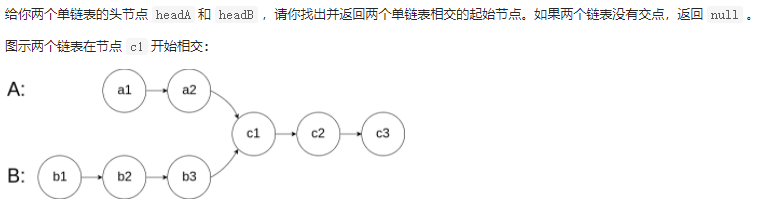
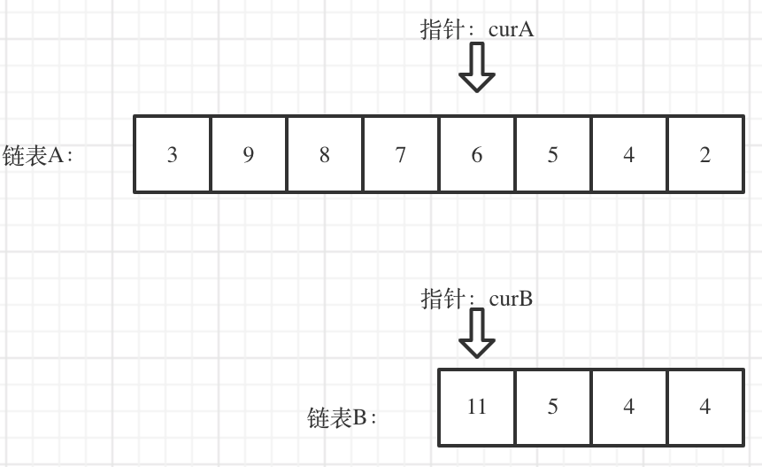

# 【链表】相交


[TOC]

## 一、链表相交



#### [面试题 02.07. 链表相交](https://leetcode-cn.com/problems/intersection-of-two-linked-lists-lcci/)

求两个链表是否存在相交部分，就是求两个链表是否存在两个相同的指针指向相同的地址

注意：指针相同和指针的值相同是不同的概念！

思路：

#### （1）首先定义两个当前指针来准备遍历两个链表


```c++
ListNode *curA=headA;
ListNode *curB=headB;
```

#### （2）更改指针初始位置

因为我们要比较两个链表，初始比较位置很重要，根据题意，初始位置如下：



先获取两个链表的长度，然后根据长度差移动较长当前指针的初始位置：

```c++
// 获取A和B的长度
int lenA=0,lenB=0;
while(curA!=NULL){
    curA=curA->next;
    lenA++;
}
while(curB!=NULL){
    curB=curB->next;
    lenB++;
}
//从两个链表按照后端对齐
curA = headA;
curB = headB;
// 让curA为最长链表的头，lenA为其长度
if (lenB > lenA) {
    int gap = lenB - lenA;
    while(gap--){
        lenB=lenB->next;
    }
}else{
    int gap = lenA - lenB;
    while(gap--){
        lenA=lenA->next;
    }
}
```

------

#### （3）开始遍历比较两个链表的节点是否相同，有相同直接返回：

```c++
//比较curA和curB此时是否相等
        while(curA&&curB){
            //如果有一对指针相等则满足要求
            if(curA==curB){
                return curA;
            }
            curB=curB->next;
            curA=curA->next;
        }
        return NULL;
```

